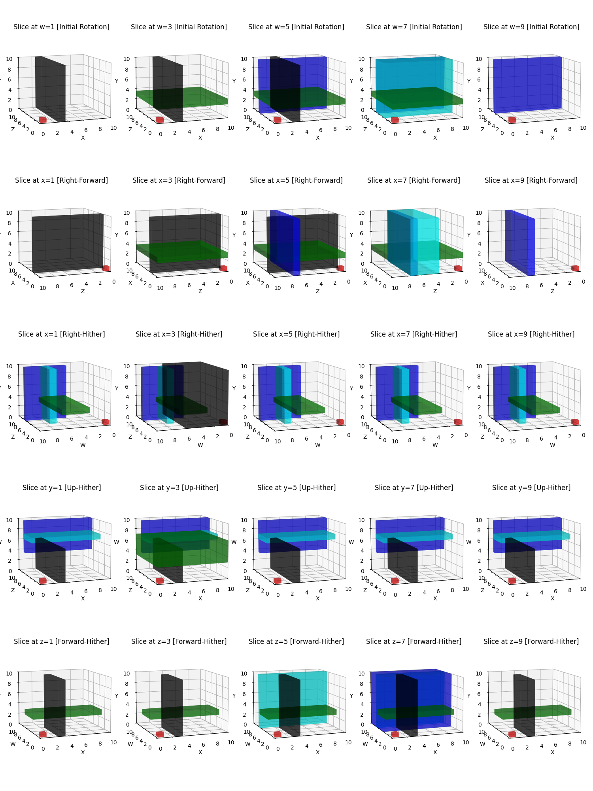

Even if level 6 maze in hypershack 0.2 contains only 4 tesseracts, it feels pretty hard to grasp where you are going. Below is a "map" of the level 6 maze, displaying selected slices over the dimension that's perpendiculr to the observable 3d space, first in the initial orientation and then after selected 90 degree rotations. 

<!--more-->



In the map the red small cube is the initial position in the first row of plots and the position after rotating 90 degrees to different directions. To make sense of this, study first the first and second row, where there has been no rotation around 4th dimension, but only a normal rotation to right. 


The plot is generated with following code. 

```python

import matplotlib.pyplot as plt
from mpl_toolkits.mplot3d import Axes3D

def transform_tesseract(tesseract, rotation):
    # Adjust transformations to ensure they align with right-handed system and the correct axis are set after the "camera rotation"
    min_x, max_x, min_y, max_y, min_z, max_z, min_w, max_w, color = tesseract
    if rotation == 'xz':
        return (min_z, max_z, min_y, max_y, min_x, max_x, min_w, max_w, color)
    elif rotation == 'xw':
        return (min_w, max_w, min_y, max_y, min_z, max_z, min_x, max_x, color)
    elif rotation == 'yw':
        return (min_x, max_x, min_w, max_w, min_z, max_z, min_y, max_y, color)
    elif rotation == 'zw':
        return (min_x, max_x, min_y, max_y, min_w, max_w, min_z, max_z, color)
    return tesseract  # return original if no rotation specified

def plot_tesseract_slices_3d(tesseracts, rotations):
    fig = plt.figure(figsize=(15, 20))
    w_slices = [1, 3, 5, 7, 9]
    num_rotations = len(rotations)
    axes = []

    for rotation_idx, rotation_detail in enumerate(rotations):
        rotation, xlabel, ylabel, zlabel = rotation_detail
        for i, w in enumerate(w_slices):
            rotlabel = 'Initial Rotation' 
            ax_idx = rotation_idx * len(w_slices) + i + 1
            ax = fig.add_subplot(num_rotations, len(w_slices), ax_idx, projection='3d')
            ax.set_title(f'Slice at w={w} [{rotlabel}]')
            
            ax.set_xlim([0, 10])
            ax.set_ylim([0, 10])
            ax.set_zlim([0, 10])

            # Set axis limits based on rotation
            if rotation == 'xz':
                ax.set_title(f'Slice at x={w} [{"Right-Forward"}]')
                ax.set_xlim([10, 0])
            elif rotation == 'xw':
                ax.set_title(f'Slice at x={w} [{"Right-Hither"}]')
                ax.set_xlim([10, 0])
            elif rotation == 'yw':
                ax.set_title(f'Slice at y={w} [{"Up-Hither"}]')
                ax.set_ylim([0, 10])
            elif rotation == 'zw':
                ax.set_title(f'Slice at z={w} [{"Forward-Hither"}]')
                ax.set_zlim([0, 10])
                
            ax.set_xlabel(xlabel)
            ax.set_ylabel(ylabel)
            ax.set_zlabel(zlabel)
            ax.view_init(elev=10, azim=-110)
            axes.append(ax)

            for tesseract in tesseracts:
                transformed_tesseract = transform_tesseract(tesseract, rotation)
                min_x, max_x, min_y, max_y, min_z, max_z, min_w, max_w, color = transformed_tesseract
                if min_w <= w <= max_w:
                    ax.bar3d(min_x, min_z, min_y, max_x - min_x, max_z - min_z, max_y - min_y, color=color, alpha=0.5)
            ax.bar3d(0.1, 0.1, 0.1, 0.8,  0.8,  0.8, color='red', alpha=0.5)
    def on_move(event):
        if event.inaxes in axes:
            for ax in axes:
                if ax != event.inaxes:
                    ax.view_init(elev=event.inaxes.elev, azim=event.inaxes.azim)
                    ax.dist = event.inaxes._dist
            fig.canvas.draw_idle()

    fig.canvas.mpl_connect('motion_notify_event', on_move)
    plt.tight_layout()
    plt.savefig('plot.png')
    plt.show()

# Define your rotations with detailed axis configuration
rotations = [
    ['',   'X', 'Z', 'Y'],
    ['xz', 'Z', 'X', 'Y'],
    ['xw', 'W', 'Z', 'Y'],
    ['yw', 'X', 'Z', 'W'],
    ['zw', 'X', 'W', 'Y']
]

# Define your tesseracts (example)
tesseracts = [
    (2.5, 3.5, 0, 10, 0, 10, 0, 6, 'black'),
    (0, 10, 2.5, 3.5, 0, 10, 3, 7, 'green'),
    (0, 10, 0, 10, 6.5, 7.5, 4, 10, 'blue'),
    (0, 10, 0, 10, 3.5, 7.5, 6.5, 7.5, 'cyan')
]

plot_tesseract_slices_3d(tesseracts, rotations)


```